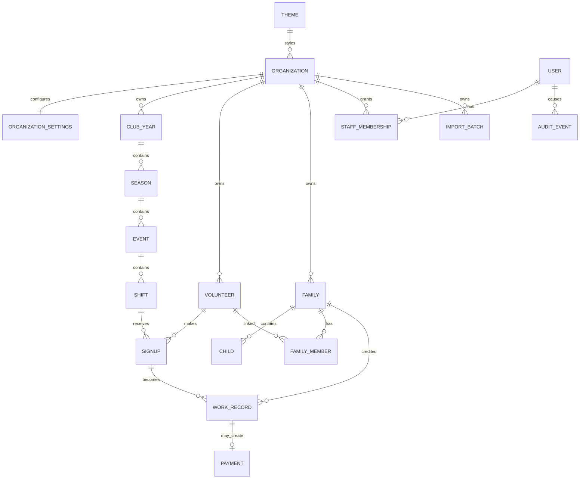

# Data Model

## Overview

## Tenant Boundary

`Organization` is the root tenant entity. Every business record is directly or indirectly scoped to exactly one organization.

Rules:

- Volunteers are organization-local.
- Families are organization-local.
- Staff memberships are organization-local.
- Seasons, events, shifts, signups, work records, payments, statistics, and exports are organization-local through their parent chain.
- A global user may have memberships in multiple organizations, but permissions are evaluated per organization.
- A person helping multiple organizations is represented by separate organization-local volunteer records unless a later account-linking feature explicitly connects them.

## Core Entities

### Organization

- id
- themeId
- name
- shortName
- slug
- customDomain nullable
- timezone
- locale
- language
- currency
- contactEmail nullable
- contactPhone nullable
- contactUrl nullable

### Theme

- id
- name
- logoUrl nullable
- primaryColor
- secondaryColor

### OrganizationSettings

- id
- organizationId
- payoutRateMinorPerHour
- signupRateLimitPerContact
- signupRateLimitWindowMinutes
- coordinationContactLabel nullable

### User

- id
- emailNormalized
- displayName
- passwordHash
- status: INVITED | ACTIVE | DISABLED
- platformRole: PLATFORM_OPERATOR, nullable (D-037; never writable via API, assigned only through a controlled platform-admin process; independent of `StaffMembership`)
- emailVerifiedAt nullable
- lastLoginAt nullable
- createdAt
- updatedAt

Full authentication schema (`RefreshToken`, `PasswordResetToken`, `Invitation`, and the finalized
`StaffMembership`/`AuditEvent` migration) is specified in `docs/F002_PLAN.md` §4–5 and lands with F002;
Core identity tables are migrated in F002 Step 2; refresh tokens landed in Step 3; password reset
tokens landed in Step 6; invitations landed in Step 7.

### PasswordResetToken

- id
- userId
- tokenHash, unique, stores SHA-256 of the opaque raw token only
- expiresAt
- consumedAt nullable
- createdAt

Password reset tokens are platform-level user tokens, not organization-scoped data. Raw reset tokens
are never stored, logged, returned in API responses, or written to audit metadata.

### Invitation

- id
- userId
- organizationId
- role: ADMIN | KOORDINATION | KIOSK | VORSTAND_LESEN
- tokenHash, unique, stores SHA-256 of the opaque raw token only
- expiresAt
- acceptedAt nullable
- revokedAt nullable
- createdByUserId
- createdAt

Pending invitations are unique per organization and user. Acceptance derives user, organization,
and role exclusively from the invitation, creates or activates the organization membership, and
consumes the token exactly once. Raw invitation tokens are never stored, logged, returned in API
responses, or written to audit metadata.

### StaffMembership

- id
- organizationId
- userId
- role: ADMIN | KOORDINATION | KIOSK | VORSTAND_LESEN
- active
- scope nullable
- createdAt
- updatedAt

### ClubYear

- id
- organizationId
- label
- startDate
- endDate
- status
- createdAt
- updatedAt

Status is `DRAFT | ACTIVE | CLOSED | ARCHIVED`. `organizationId`, start date, and end date are indexed together. Date ranges are inclusive and checked in both API validation and the database.

### Season

- id
- clubYearId
- type: AUTUMN | SPRING | OTHER
- name
- startDate
- endDate
- status: DRAFT | ACTIVE | CLOSED | ARCHIVED
- createdAt
- updatedAt

The club-year foreign key cascades deletion to seasons. Club-year/date lookup is indexed. A season's containment inside its club year is enforced in the service layer because it spans parent and child rows.

### Event

Implemented in F003 Step 3.

- id
- seasonId
- title
- date
- location
- eventType
- publicDescription
- internalNote
- status: DRAFT | PUBLISHED | POSTPONED | CANCELLED | COMPLETED
- publishedAt
- sourceImportId nullable
- createdAt
- updatedAt

Events inherit organization scope through their season and club year. Season/date lookup is indexed; the service enforces the inclusive parent-season date range.

### Shift

Implemented in F003 Step 3.

- id
- eventId
- startsAt
- endsAt
- requiredVolunteers
- publicNote
- internalNote
- status: OPEN | CLOSED | CANCELLED
- sortOrder
- createdAt
- updatedAt

Shifts inherit organization scope through their event. Event/order/time lookup is indexed; database checks and service validation enforce a positive volunteer count and ordered times, while the service also keeps both timestamps on the event date.

### Volunteer

Materialized for public self-signup in F004 Step 2. `preferredLanguage`, `accountUserId`, and
`mergedIntoId` remain deferred; created and updated timestamps are included.

- id
- organizationId
- firstName
- lastName
- phoneNormalized
- phoneDisplay
- emailNormalized
- emailDisplay
- preferredLanguage
- accountUserId nullable
- publicDisplayConsentAt nullable
- mergedIntoId nullable
- status
- internalNote
- createdFrom: PUBLIC_SIGNUP | IMPORT | ADMIN

### Signup

Materialized for immediate public reservations in F004 Step 2. F004 Step 3 generates management
tokens for new public signups, persists only their SHA-256 hashes, and materializes cancellation
timestamp/reason metadata. Compensation/family assignment and confirmation delivery remain deferred.

- id
- shiftId
- volunteerId
- provisionalCompensationType
- provisionalFamilyId nullable
- publicNameSnapshot
- status: ACTIVE | CANCELLED_BY_VOLUNTEER | CANCELLED_BY_ADMIN
- outcome: OPEN | ATTENDED | EXCUSED_CANCELLED | LATE_CANCELLED | NO_SHOW | SUBSTITUTE_ORGANIZED
- managementTokenHash nullable (SHA-256 hex digest only; raw token is never persisted)
- confirmedAt
- cancelledAt nullable
- cancellationReason nullable (`VOLUNTEER_SELF_SERVICE` for the Step 3 public flow;
  `ADMIN_MANUAL` for the Step 3.1 staff flow)
- source: PUBLIC_SIGNUP | ADMIN | IMPORT

### Family

- id
- organizationId
- displayName
- status
- internalNote

### Child

- id
- familyId
- firstName
- lastName
- team
- activeFrom
- activeUntil

### FamilyMember

- id
- familyId
- volunteerId
- relationship
- verifiedAt
- isPrimaryContact

### FamilyRequirement

- id
- familyId
- clubYearId
- requiredMinutes
- reason
- source: DEFAULT | OVERRIDE

### WorkRecord

- id
- signupId
- shiftId
- volunteerId
- actualStart
- actualEnd
- breakMinutes
- durationMinutes
- finalCompensationType
- creditedFamilyId nullable
- submittedByVolunteerAt
- confirmedByAdminAt
- source: DIGITAL | PAPER | IMPORT
- note

### Payment

- id
- workRecordId
- rateRappenPerHour
- amountRappen
- status: OPEN | APPROVED | PAID
- paidAt
- note

### AuditEvent

- id
- organizationId nullable for platform-level events
- actorUserId nullable
- action
- entityType
- entityId
- metadata
- createdAt

### ImportBatch

- id
- organizationId
- filename
- fileHash
- importType
- status
- importedAt
- summary
- errorReport

## Organization Resolution (F001)

Organization resolution order:

1. Custom domain.
2. Subdomain.
3. URL path.
4. Development override `?org=`.
5. Development-only fallback when `APP_ENV=development` and exactly one organization exists.

The fallback is forbidden in production.

## Public Organization API (F001)

`GET /api/public/organization` returns only public-safe organization metadata:

- name
- short name
- slug
- theme: name, logo URL, primary color, secondary color
- language
- locale
- timezone
- currency
- public contact fields
- public-safe settings from `OrganizationSettings`

## Constraints

- All business queries must be scoped to organization.
- Signup, shift, volunteer, family, work record, and payment references must resolve to the same organization.
- Active signups per shift must not exceed `requiredVolunteers`.
- Phone and email values are stored normalized and display-formatted.
- Signup management links are stored only as hashes.
- A work record represents actual work only.
- A work record may not be both family credit and payout.
- Duration is stored in integer minutes and may not be negative.
- Amounts are stored in integer minor units.
- Public APIs must not expose contact data, child data, internal notes, or cross-organization identifiers.
