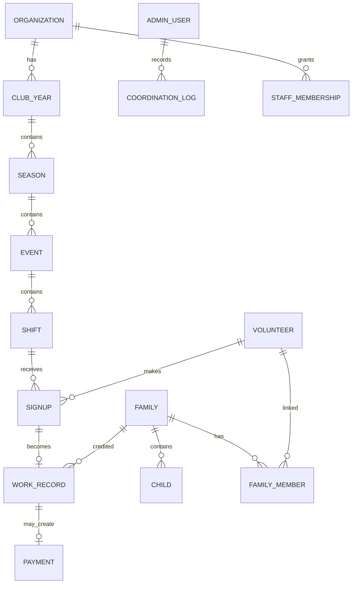

# Fachliches Datenmodell

## Übersicht

## Kernentitäten

### Organization
Für Version 1 genau eine Organisation, technisch trotzdem eigene Entität.
- id
- name
- shortName
- timezone
- locale
- logo
- primaryColor
- accentColor
- settings

### ClubYear
Beispiel 2026/2027.
- id
- organizationId
- label
- startDate
- endDate
- status

### Season
Teil-Saison innerhalb eines Vereinsjahres.
- id
- clubYearId
- type: AUTUMN | SPRING | OTHER
- name
- startDate
- endDate
- status

### Event
Ein Heimspieltag, Turnier, Cupspiel oder anderer Anlass.
- id
- seasonId
- title
- date
- location
- eventType
- publicDescription
- internalNote
- status
- publishedAt
- sourceImportId

### Shift
Konkreter Einsatzzeitraum.
- id
- eventId
- startsAt
- endsAt
- requiredVolunteers
- publicNote
- internalNote
- status
- sortOrder

### Volunteer
Natürliche Person, unabhängig davon, ob ein Konto besteht.
- id
- firstName
- lastName
- phoneNormalized
- phoneDisplay
- emailNormalized
- emailDisplay
- preferredLanguage
- accountUserId nullable
- status
- internalNote
- createdFrom: PUBLIC_SIGNUP | IMPORT | ADMIN

### Signup
Reservierung eines Helferplatzes.
- id
- shiftId
- volunteerId
- provisionalCompensationType
- provisionalFamilyId nullable
- publicNameSnapshot
- status
- managementTokenHash
- confirmedAt
- cancelledAt
- cancellationReason
- source

### WorkRecord
Tatsächlich geleistete Arbeit.
- id
- signupId nullable
- shiftId
- volunteerId
- actualStart
- actualEnd
- breakMinutes
- durationMinutes
- finalCompensationType
- creditedFamilyId nullable
- attendanceStatus
- submittedByVolunteerAt
- confirmedByAdminAt
- source: DIGITAL | PAPER | IMPORT
- note

### Family
Gemeinsames Sollstundenkonto.
- id
- organizationId
- displayName
- status
- internalNote

### Child
- id
- familyId
- firstName
- lastName
- team
- activeFrom
- activeUntil

### FamilyMember
Zuordnung von Helfer zu Familie.
- id
- familyId
- volunteerId
- relationship
- verifiedAt
- isPrimaryContact

### FamilyRequirement
Sollwert pro Vereinsjahr.
- id
- familyId
- clubYearId
- requiredMinutes
- reason
- source: DEFAULT | OVERRIDE

### Payment
- id
- workRecordId
- rateRappenPerHour
- amountRappen
- status: OPEN | APPROVED | PAID
- paidAt
- note

### CoordinationLog
Nur Admin sichtbar.
- id
- adminUserId
- seasonId
- date
- durationMinutes
- activityType
- note
- rateRappenPerHour
- paymentStatus

### StaffMembership
- id
- organizationId
- userId
- role
- active
- scope optional

### AuditEvent
- id
- actorType
- actorId
- action
- entityType
- entityId
- previousData
- newData
- createdAt

### ImportBatch
- id
- filename
- fileHash
- importType
- status
- importedAt
- summary
- errorReport

## Wichtige Constraints

- aktive Signups pro Schicht dürfen `requiredVolunteers` nicht überschreiten
- Telefonnummer und E-Mail normalisiert speichern
- Signup-Verwaltungslinks nur gehasht speichern
- ein WorkRecord darf nicht gleichzeitig Sollstunden und Auszahlung sein
- Auszahlungsbetrag wird serverseitig berechnet
- Dauer darf nicht negativ sein
- Saison muss zum Vereinsjahr gehören
