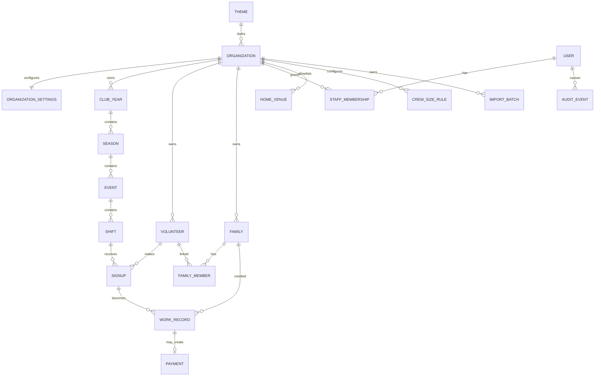

# Data Model

## Overview

```mermaid
erDiagram
  THEME ||--o{ ORGANIZATION : styles
  ORGANIZATION ||--|| ORGANIZATION_SETTINGS : configures
  ORGANIZATION ||--o{ CLUB_YEAR : owns
  ORGANIZATION ||--o{ VOLUNTEER : owns
  ORGANIZATION ||--o{ FAMILY : owns
  ORGANIZATION ||--o{ STAFF_MEMBERSHIP : grants
  ORGANIZATION ||--o{ HOME_VENUE : allowlists
  ORGANIZATION ||--o{ CREW_SIZE_RULE : configures
  ORGANIZATION ||--o{ IMPORT_BATCH : owns
  CLUB_YEAR ||--o{ SEASON : contains
  SEASON ||--o{ EVENT : contains
  EVENT ||--o{ SHIFT : contains
  SHIFT ||--o{ SIGNUP : receives
  VOLUNTEER ||--o{ SIGNUP : makes
  SIGNUP ||--o{ WORK_RECORD : becomes
  FAMILY ||--o{ FAMILY_MEMBER : has
  VOLUNTEER ||--o{ FAMILY_MEMBER : linked
  FAMILY ||--o{ WORK_RECORD : credited
  WORK_RECORD ||--o| PAYMENT : may_create
  USER ||--o{ STAFF_MEMBERSHIP : has
  USER ||--o{ AUDIT_EVENT : causes
```

## Tenant Boundary

`Organization` is the root tenant entity. Every business record is directly or indirectly scoped to exactly one organization.

Rules:

- Volunteers are organization-local.
- Families are organization-local.
- Staff memberships are organization-local.
- Seasons, events, shifts, signups, work records, payments, statistics, and exports are organization-local through their parent chain.
- A global user may have memberships in multiple organizations, but permissions are evaluated per organization.
- A person helping multiple organizations is represented by separate organization-local volunteer records unless a later account-linking feature explicitly connects them.

## Core Entities

### Organization

- id
- themeId
- name
- shortName
- slug
- customDomain nullable
- timezone
- locale
- language
- currency
- contactEmail nullable
- contactPhone nullable
- contactUrl nullable

### Theme

- id
- name
- logoUrl nullable
- primaryColor
- secondaryColor

### OrganizationSettings

- id
- organizationId
- payoutRateMinorPerHour
- signupRateLimitPerContact
- signupRateLimitWindowMinutes
- coordinationContactLabel nullable

### HomeVenue

Implemented for the Grill-workflow game-plan import (D-041). A configurable, organization-scoped
allowlist of venues that count as a catering home venue; only games at an active home venue are
proposed for inclusion during import. Soft-deactivated via `isActive`, never hard-deleted, so
historical imports and events keep a valid reference.

- id
- organizationId
- name
- nameNormalized (lower/trim/collapsed-whitespace, used for de-duplication and matching)
- isActive
- createdAt
- updatedAt

### CrewSizeRule

Implemented for the Grill-workflow crew-size/menu suggestion engine (D-041). Organization-scoped,
ordered rules matching a game's team text to a suggested menu type and required griller count. One
non-deletable, always-last-evaluated default rule (`pattern = null`) guarantees a suggestion always
exists. Suggestions are always editable and never silently applied.

- id
- organizationId
- sortOrder
- pattern nullable (null marks the default/catch-all rule)
- menuType (`FRIES_NUGGETS` | `FRIES_NUGGETS_BURGER`)
- requiredGrillerCount
- minGamesPerShift
- isActive
- createdAt
- updatedAt

### User

- id
- emailNormalized
- displayName
- passwordHash
- status: INVITED | ACTIVE | DISABLED
- platformRole: PLATFORM_OPERATOR, nullable (D-037; never writable via API, assigned only through a controlled platform-admin process; independent of `StaffMembership`)
- emailVerifiedAt nullable
- lastLoginAt nullable
- createdAt
- updatedAt

Full authentication schema (`RefreshToken`, `PasswordResetToken`, `Invitation`, and the finalized
`StaffMembership`/`AuditEvent` migration) is specified in `docs/F002_PLAN.md` §4–5 and lands with F002;
Core identity tables are migrated in F002 Step 2; refresh tokens landed in Step 3; password reset
tokens landed in Step 6; invitations landed in Step 7.

### PasswordResetToken

- id
- userId
- tokenHash, unique, stores SHA-256 of the opaque raw token only
- expiresAt
- consumedAt nullable
- createdAt

Password reset tokens are platform-level user tokens, not organization-scoped data. Raw reset tokens
are never stored, logged, returned in API responses, or written to audit metadata.

### Invitation

- id
- userId
- organizationId
- role: ADMIN | KOORDINATION | KIOSK | VORSTAND_LESEN
- tokenHash, unique, stores SHA-256 of the opaque raw token only
- expiresAt
- acceptedAt nullable
- revokedAt nullable
- createdByUserId
- createdAt

Pending invitations are unique per organization and user. Acceptance derives user, organization,
and role exclusively from the invitation, creates or activates the organization membership, and
consumes the token exactly once. Raw invitation tokens are never stored, logged, returned in API
responses, or written to audit metadata.

### StaffMembership

- id
- organizationId
- userId
- role: ADMIN | KOORDINATION | KIOSK | VORSTAND_LESEN
- active
- scope nullable
- createdAt
- updatedAt

### ClubYear

- id
- organizationId
- label
- startDate
- endDate
- status
- createdAt
- updatedAt

Status is `DRAFT | ACTIVE | CLOSED | ARCHIVED`. `organizationId`, start date, and end date are indexed together. Date ranges are inclusive and checked in both API validation and the database.

### Season

- id
- clubYearId
- type: AUTUMN | SPRING | OTHER
- name
- startDate
- endDate
- status: DRAFT | ACTIVE | CLOSED | ARCHIVED
- createdAt
- updatedAt

The club-year foreign key cascades deletion to seasons. Club-year/date lookup is indexed. A season's containment inside its club year is enforced in the service layer because it spans parent and child rows.

### Event

Implemented in F003 Step 3. `sourceImportId`, `kickoffTime`, `externalGameNumber`, and
`importMatchKey` were added in F015 Phase 2 for game-plan import provenance and re-import matching;
`sourceImportId` is a real foreign key to `ImportBatch` (`ON DELETE SET NULL`).

- id
- seasonId
- title
- date
- location
- eventType
- publicDescription
- internalNote
- status: DRAFT | PUBLISHED | POSTPONED | CANCELLED | COMPLETED
- publishedAt
- sourceImportId nullable (FK ImportBatch)
- kickoffTime nullable (display only; does not derive shift times)
- externalGameNumber nullable (association's `Spielnummer`, absent for friendlies)
- importMatchKey nullable, indexed with seasonId (re-import matching key; `NULL` for manually
  created events, which re-import therefore never touches)
- createdAt
- updatedAt

### ImportBatch

Implemented in F015 Phase 2. One row per uploaded Heimspielplan file.

- id
- organizationId
- clubYearId (FK ClubYear, RESTRICT)
- sourceFilename
- uploadedByUserId (FK User, RESTRICT)
- status: STAGED | CONFIRMED | DISCARDED
- uploadedAt
- confirmedAt nullable
- confirmedByUserId nullable (FK User, SET NULL)
- rowCount
- createdAt
- updatedAt

### ImportRow

Implemented in F015 Phase 2. One row per parsed game, staged for review before any `Event` write.
Diffing against existing events uses `importMatchKey` (association `Spielnummer` when present,
otherwise normalized teams + date) and classifies each row as `NEU` | `GEAENDERT` | `VERSCHOBEN` |
`ENTFERNT` | `UNVERAENDERT`. Applying a batch never writes to `Event` for `VERSCHOBEN`, `ENTFERNT`,
or `UNVERAENDERT` rows — see `docs/ARCHITECTURE.md` for the exact per-classification apply rules.

- id
- importBatchId (FK ImportBatch, CASCADE)
- seasonId (FK Season, RESTRICT)
- sheetTab
- spielTyp: MEISTERSCHAFT | CUP | TESTSPIEL | TURNIER (matched by recognized-prefix, not exact
  equality, since a real export includes free-text tournament names appended to "Turnier", e.g.
  "Turnier Junior*innen E-F-G / Brack play more football")
- bezeichnung nullable
- spielnummer nullable (association's game number; `NULL` when the source says "Ohne" or "keine" —
  verified against a real 2026/27 export where the club's own Kiosk/Grillplan variant of the file
  uses "keine" for the same placeholder meaning)
- weekdayShort nullable
- gameDate
- gameTime nullable
- teams
- venue
- venueNormalized
- remark nullable
- isHomeVenue (computed against the `HomeVenue` allowlist at staging time)
- classification: NEU | GEAENDERT | VERSCHOBEN | ENTFERNT | UNVERAENDERT
- matchedEventId nullable (FK Event, SET NULL)
- diffDetails nullable (JSON `{field: {old, new}}`)
- includeDecision: INCLUDE | EXCLUDE (defaults from `isHomeVenue`, always manually overridable)
- grillShiftDecision: PENDING | CREATE_SHIFT | NO_SHIFT (per-game manual decision, tracked here;
  does not itself create a `Shift` — that wiring is F015 Phase 3)
- verschobenAcknowledgedAt nullable (coordinator confirms they contacted affected helpers outside
  the app; does not gate batch confirmation)
- appliedAt nullable (set for every row when the batch is confirmed, regardless of decision)
- createdAt
- updatedAt

Events inherit organization scope through their season and club year. Season/date lookup is indexed; the service enforces the inclusive parent-season date range.

### Shift

Implemented in F003 Step 3. `shiftType`, `assignmentMode`, `menuType`, and
`crewSuggestionOverridden` were added in F015 Phase 3.

- id
- eventId
- startsAt
- endsAt
- requiredVolunteers
- publicNote
- internalNote
- status: OPEN | CLOSED | CANCELLED
- sortOrder
- shiftType: GRILL | KIOSK (default GRILL; KIOSK is Kiosk-module preparation, unused until F015
  Phase 6)
- assignmentMode: OPEN_SIGNUP | FIXED_ASSIGNMENT (default OPEN_SIGNUP; FIXED_ASSIGNMENT is
  Kiosk-module preparation, unused until F015 Phase 6)
- menuType nullable (`FRIES_NUGGETS` | `FRIES_NUGGETS_BURGER`; drives the crew-size suggestion)
- crewSuggestionOverridden (server-computed bookkeeping flag: did the submitted `menuType`/
  `requiredVolunteers` differ from what the crew-size rule engine suggested at save time; never
  client-settable)
- createdAt
- updatedAt

Shifts inherit organization scope through their event. Event/order/time lookup is indexed; database checks and service validation enforce a positive volunteer count and ordered times, while the service also keeps both timestamps on the event date.

The crew-size suggestion (`GET /api/admin/{org}/events/{event_id}/shift-suggestion`) evaluates the
organization's `CrewSizeRule` rows against the event's team text (`publicDescription` or `title`)
with `concurrent_games=1`, since a `Shift` belongs to exactly one `Event` today — rules requiring
more than one concurrent game never match yet; multi-game shift consolidation is a future, undecided
contract. The suggestion is always a pre-fill, never silently applied.

### Volunteer

Materialized for public self-signup in F004 Step 2. `preferredLanguage`, `accountUserId`, and
`mergedIntoId` remain deferred; created and updated timestamps are included.

- id
- organizationId
- firstName
- lastName
- phoneNormalized
- phoneDisplay
- emailNormalized
- emailDisplay
- preferredLanguage
- accountUserId nullable
- publicDisplayConsentAt nullable
- mergedIntoId nullable
- status
- internalNote
- createdFrom: PUBLIC_SIGNUP | IMPORT | ADMIN

### Signup

Materialized for immediate public reservations in F004 Step 2. F004 Step 3 generates management
tokens for new public signups, persists only their SHA-256 hashes, and materializes cancellation
timestamp/reason metadata. F004 Step 4 dispatches a confirmation email using the raw token
transiently; no additional column is persisted for it. `Signup` carries no compensation or family
fields today and is not planned to: per D-041, compensation type and child/family credit are
decided at shift close-out (often long after signup, sometimes with no signup at all for paper
entries) and belong on a separate future `WorkRecord` entity, optionally linked back to a `Signup`.

- id
- shiftId
- volunteerId
- publicNameSnapshot
- status: ACTIVE | CANCELLED_BY_VOLUNTEER | CANCELLED_BY_ADMIN
- outcome: OPEN | ATTENDED | EXCUSED_CANCELLED | LATE_CANCELLED | NO_SHOW | SUBSTITUTE_ORGANIZED;
  defaults to OPEN. F009 permits staff updates only while `status = ACTIVE`, exposes the value only
  through authenticated admin planning responses, and audits real outcome changes through
  `AuditEvent`.
- managementTokenHash nullable (SHA-256 hex digest only; raw token is never persisted)
- confirmedAt
- cancelledAt nullable
- cancellationReason nullable (`VOLUNTEER_SELF_SERVICE` for the Step 3 public flow;
  `ADMIN_MANUAL` for the Step 3.1 staff flow)
- source: PUBLIC_SIGNUP | ADMIN | IMPORT

### Family

Implemented in F007 Step 1.

- id
- organizationId
- displayName
- status: ACTIVE (only status implemented; no deactivate/delete endpoint exists yet)
- internalNote
- createdAt
- updatedAt

### FamilyMember

Implemented in F007 Step 1/2. Unifies the previously separate Child/FamilyMember concepts into one
entity distinguished by `memberType`; there is no separate `Child` table. Create and list endpoints
exist; there is no update/delete endpoint for the member's own fields, only a dedicated PATCH to
change or clear the `volunteerId` link on a HELPER member.

- id
- familyId
- memberType: CHILD | HELPER
- firstName
- lastName
- volunteerId nullable (only meaningful for HELPER members)

### FamilyRequirement

Not implemented. The Sollstunden materialization/freeze/override behavior from BR-001/D-024 has no
backing table or endpoint yet; the rule is currently applied only manually against the season-end
Excel export. Needs its own decision record and contract before implementation (see
`docs/BACKLOG.md`).

### WorkRecord

- id
- signupId
- shiftId
- volunteerId
- actualStart
- actualEnd
- breakMinutes
- durationMinutes
- finalCompensationType
- creditedFamilyId nullable
- submittedByVolunteerAt
- confirmedByAdminAt
- source: DIGITAL | PAPER | IMPORT
- note

### Payment

- id
- workRecordId
- rateRappenPerHour
- amountRappen
- status: OPEN | APPROVED | PAID
- paidAt
- note

### AuditEvent

- id
- organizationId nullable for platform-level events
- actorUserId nullable
- action
- entityType
- entityId
- metadata
- createdAt

Attendance outcome changes use `action = ATTENDANCE_OUTCOME_CHANGED`, `entityType = signup`,
`entityId = Signup.id`, tenant `organizationId`, the authenticated actor user id, and metadata with
only `previous_outcome` and `new_outcome`.

### ImportBatch

- id
- organizationId
- filename
- fileHash
- importType
- status
- importedAt
- summary
- errorReport

## Organization Resolution (F001)

Organization resolution order:

1. Custom domain.
2. Subdomain.
3. URL path.
4. Development override `?org=`.
5. Development-only fallback when `APP_ENV=development` and exactly one organization exists.

The fallback is forbidden in production.

## Public Organization API (F001)

`GET /api/public/organization` returns only public-safe organization metadata:

- name
- short name
- slug
- theme: name, logo URL, primary color, secondary color
- language
- locale
- timezone
- currency
- public contact fields
- public-safe settings from `OrganizationSettings`

## Constraints

- All business queries must be scoped to organization.
- Signup, shift, volunteer, family, work record, and payment references must resolve to the same organization.
- Active signups per shift must not exceed `requiredVolunteers`.
- Phone and email values are stored normalized and display-formatted.
- Signup management links are stored only as hashes.
- A work record represents actual work only.
- A work record may not be both family credit and payout.
- Duration is stored in integer minutes and may not be negative.
- Amounts are stored in integer minor units.
- Public APIs must not expose contact data, child data, internal notes, or cross-organization identifiers.
